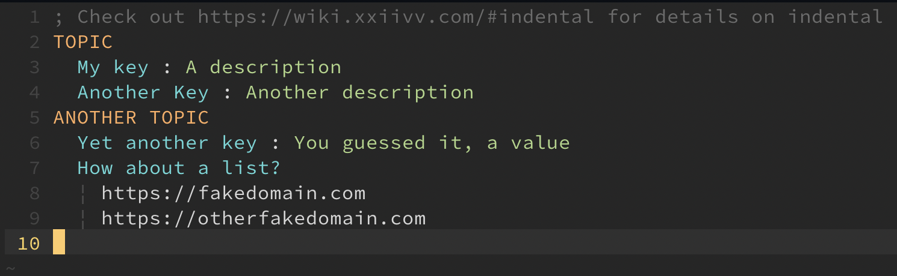

# vim-indental

Vim syntax for [indental](https://wiki.xxiivv.com/#indental)

This is very much a work in progress. In it's current state it provides basic syntax
highlighting. However, the highlighting for lists needs to be improved, and currently,
lines that contain urls are just skipped.

<p align="center"></p>

## Installation

### vim-plug
Place between `call plug#begin()` and `call plug#end()` in your `.vimrc` and then...
```vim
Plug 'ckipp01/vim-indental'
```
...followed by...
```vim
:source %
:PlugInstall
```

### Pathogen
Simply clone into wherever you have Pathogen pointed to.
```sh
cd ~/.vim/bundle
git clone https://github.com/ckipp01/vim-indental
```

### Vundle
Add into your `.vimrc`...
```vim
Plugin 'ckipp01/vim-indental'
```
...followed by...
```vim
:source %
:PluginInstall
```

#### TODO
- [x] Basic syntax highlighting
- [ ] Display list heading and entries correctly
- [ ] Decide to display urls different or not
- [ ] Add in tags to be able to jump between headings
- [ ] Complete Docs

#### Notes
Many thanks to [Devine](https://wiki.xxiivv.com/#home) for this is just one of his wonderful creations.
You can find more about indetal [here](https://wiki.xxiivv.com/#indental) on his wiki,
and you can view the actual parser [here](https://github.com/XXIIVV/Oscean/blob/master/scripts/lib/indental.js).

The original parser is in JS, but if you're interested, you can find a Ruby parser [here](https://github.com/slisne/nodaire) build by [Liam](https://liamcooke.com/).
